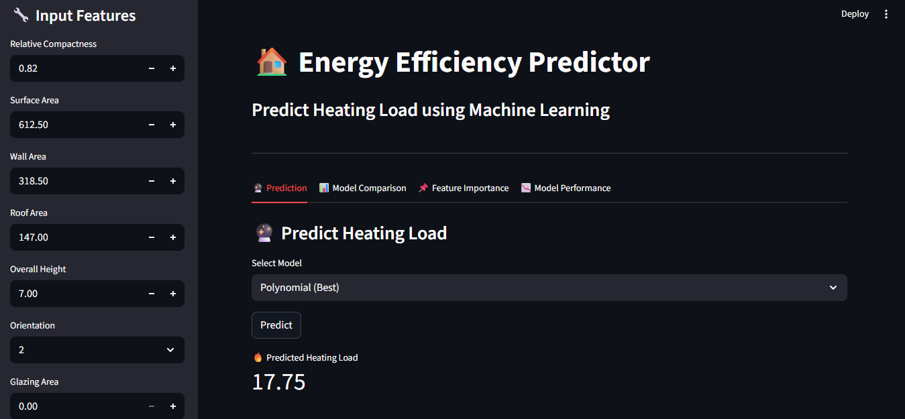
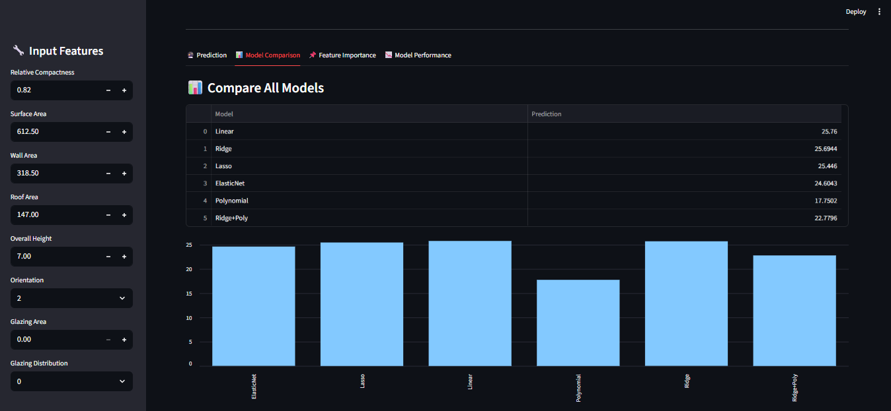
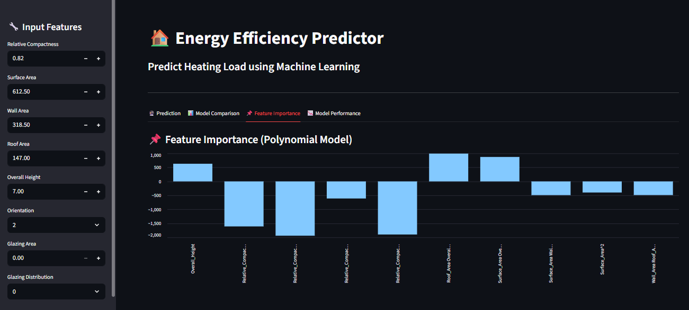

# Energy Efficiency Prediction using Machine Learning

## 📌 Overview

This project predicts the **Heating Load of buildings** using multiple regression techniques on the UCI Energy Efficiency dataset.
It demonstrates a complete machine learning pipeline including data analysis, model building, evaluation, and deployment using Streamlit.

---

## 🚀 Features

* 📊 Exploratory Data Analysis (EDA)
* 🔍 Multicollinearity detection using VIF
* 🤖 Multiple Regression Models:

  * Linear Regression
  * Ridge Regression
  * Lasso Regression
  * ElasticNet
  * Polynomial Regression
* 📈 Model comparison using R², MAE, RMSE
* 📌 Feature importance analysis
* 🌐 Interactive Streamlit web app

---

## 🧠 Key Insights

* Polynomial Regression achieved the best performance (**R² ≈ 0.99**)
* Multicollinearity observed among geometric features
* Regularization techniques improved model stability
* Feature interactions significantly impact heating load

---

## 📊 Model Performance

| Model                 | R² Score | RMSE     |
| --------------------- | -------- | -------- |
| Linear Regression     | 0.91     | 3.02     |
| Ridge Regression      | 0.91     | 3.03     |
| Lasso Regression      | 0.90     | 3.15     |
| ElasticNet            | 0.89     | 3.29     |
| Polynomial Regression | **0.99** | **0.80** |
| Ridge + Polynomial    | 0.95     | 2.18     |

---

## 🛠️ Tech Stack

* Python
* Pandas, NumPy
* Scikit-learn
* Matplotlib, Seaborn
* Streamlit

---

## 📂 Project Structure

```
project/
│
├── data.csv
├── notebook.ipynb
├── app.py
├── linear.pkl
├── ridge.pkl
├── lasso.pkl
├── elastic.pkl
├── poly.pkl
├── ridge_poly.pkl
└── README.md
```
---

## 📸 Screenshots

### 🔮 Prediction Interface
Displays user input and predicted heating load using the selected model.



---

### 📊 Model Comparison
Compares predictions across different regression models.



---

### 📌 Feature Importance
Shows the most influential features affecting heating load.




---

## 🎯 How It Works

1. User inputs building parameters
2. Selected ML model processes input
3. Prediction is generated in real-time
4. Visualizations explain model behavior

---

## 📈 Visualizations Included

* Model comparison chart
* Feature importance plot
* Actual vs Predicted scatter plot
* Error distribution analysis
* Feature sensitivity analysis

---

## 🧠 Learnings

* Understanding bias-variance tradeoff
* Handling multicollinearity
* Importance of feature engineering
* Model evaluation techniques
* Deployment using Streamlit

---

## 🚀 Future Improvements

* Add more real-world datasets
* Deploy app online (Streamlit Cloud)
* Add deep learning models
* Improve UI/UX design

---

## 🙌 Acknowledgements

* UCI Machine Learning Repository

---

## 📬 Contact

If you have any questions or suggestions, feel free to reach out!

---

⭐ If you like this project, give it a star!
